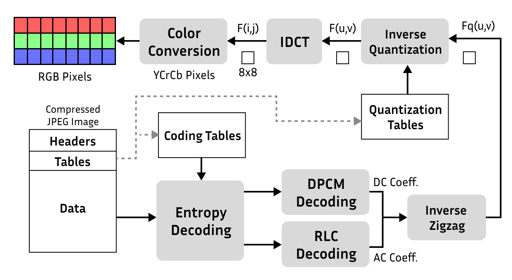
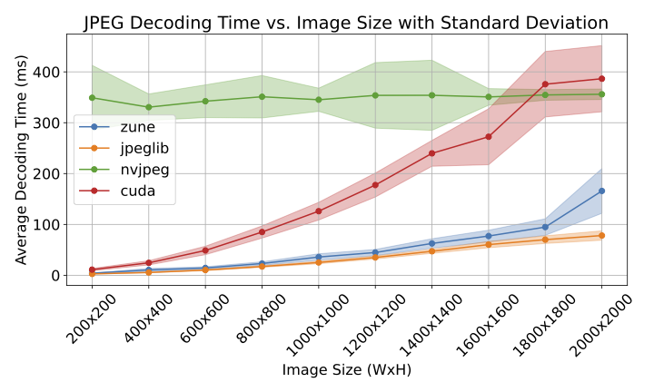
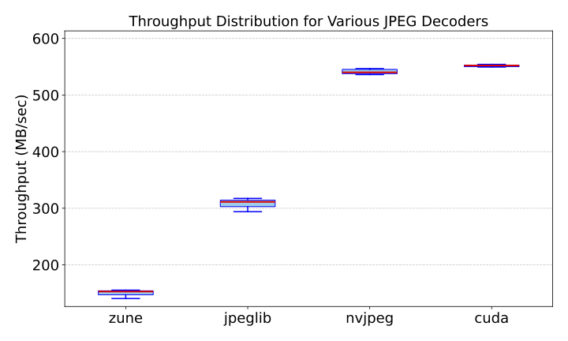

# GPU-JPEG-Decoder
Fully Parallelized GPU-only High Performance JPEG Decoder

## Introduction

Our CUDA decoder is a high-performance tool for decoding JPEG images on GPUs. This project leverages CUDA to implement efficient parallelization strategies, achieving significant speedups compared to traditional CPU (jpeglib and zune-jpeg) and GPU (nvJPEG) based decoders. The repository also includes benchmarking tools, profiling scripts, and support for testing on various datasets.


## Table of Contents

    Introduction
    Repository Structure
    Installation and Setup
    Usage Instructions
    Testing
    Benchmarking
    Profiling and GPU Analysis
    Challenges and Learnings
    Contributors




## Repository Structure
```
GPU-JPEG-Decoder/
├── datasets/       # Datasets for runtime and throughput testing
├── data_preprocessing/         # Scripts to preprocess images into 444 JPEG format
├── cpp-decoder/         # C++ implementation of the decoder
├── cuda-decoder/       # CUDA implementation (cudaO)
├── plots/                      # Benchmarking visualization scripts
├── testing/                    # Validation scripts and test cases
├── python-implementation/      # Python implementation for initial reference
└── README.md                   # Documentation
```
## Installation and Setup

Dependencies

Ensure the following dependencies are installed on your system:
```
    C++ compiler: GCC 11.4.0 or higher
    Python: Python 3.8+
    CUDA Toolkit: 11.0+
    Libraries: OpenCV, Google Benchmark
```
# Dataset

benchmark runtime (1000 images): https://polybox.ethz.ch/index.php/s/Ipnl9UDsCYQBpZQ

benchmark throughput (3000 images): https://polybox.ethz.ch/index.php/s/JTbwgz0OXwsukUK

## Step-by-Step Installation Guide

1. Clone the repository:
```
git clone https://github.com/example/GPU-JPEG-Decoder.git
cd GPU-JPEG-Decoder
```
2. Install Google Benchmark:
```
./setup_benchmark.sh
```
3. Compile the decoder:
```
    cd cuda-decoder
    make
```

## Usage Instructions

Running the Decoder

1. Navigate to the cuda-decoder directory:
   ```
   	 ./decoder /GPU-JPEG-Decoder/cuda-decoder/profile.jpg
   ```

Testing

Navigate to the testing folder before running these scripts:

```
cd testing
```

Compare Decoder Outputs: Run the decoder and compare its output to the ground truth:
```
python3 compare.py ../cuda-decoder
```
To test a specific image:

[compare.py](testing/compare.py) is for comparing the decoded channel arrays of the image with the ground truth expected output of the decoder. For each implementation, the output files are collected in a separate folder, for example [cpp_output_arrays](testing/cpp_output_arrays). The expected output files are collected in the folder [ground_truth](testing/ground_truth). 
NOTE: This python script takes command line arguments. The first argument is the path to the folder containing the decoder implementation to be tested, eg. ``../cpp-implementation`` in case of testing the cpp implementation fo the decoder. If you pass only this argument to the script as follows, it will run the decoder on all the images in [testing/images](testing/images) and compare the output to the ground truth. The output files will also be written to the corresponding output directory.

If you want to compare only a particular image, you can pass the second argument as the name of the image file in the [testing/images](testing/images) folder. For example, to compare only the image named 5_200x200.jpg, you can run the script as follows:

```
python3 compare.py ../cuda-decoder ./images/5_200x200.jpg
```
Display Decoded Images: Use the display_image.py script to visualize the decoded channel arrays:
Please see the [testing](testing/) folder which contains the following scripts. PLEASE ``cd`` into the testing directory before running these scripts and be careful of the relative addressing used:
1. [display_image.py](testing/display_image.py) is for displaying the decoded channel arrays of the image. 
To avoid installing opencv on the cluster, we write the decoded channel arrays to a file. Then we read this file using this python script and display the image using opencv-python bindings which is installed on the cluster. To use this python script, modify the path to the file. For example:

```python   
with open("./cpp_output_arrays/5_200x200.array", "r") as file:
```
    
```
python3 display_image.py /GPU-JPEG-Decoder/testing/cuda_output_arrays/profile.array
```

## Benchmarking

Navigate to cuda-decoder and go to benchmark subfolder for runtime benchmarking and benchmark_throughput for throughput benchmarking. Then simply run the following:

```
bash bench.sh
```


## Some notes on compiling on server vs locally
The g++ compiler version on the server is 11.4.0. If you add the flag -std=c++11 to the command in the makefile, it will throw errors with some of the filesystem related code I have added. So when running on the server, don't add this flag. When running locally, you might need to add this flag depending on your local compiler. 

Hence, the two versions of the makefile are as follows:

1. For server:
```
decoder: main.cpp src/parser.cpp src/huffmanTree.cpp src/idct.cpp utils/stream.cpp utils/color.cpp
	g++ -o decoder main.cpp src/parser.cpp src/huffmanTree.cpp src/idct.cpp utils/stream.cpp utils/color.cpp
```
2. For local

``` 
decoder: main.cpp src/parser.cpp src/huffmanTree.cpp src/idct.cpp utils/stream.cpp utils/color.cpp
	    g++ -std=c++11 -o decoder main.cpp src/parser.cpp src/huffmanTree.cpp src/idct.cpp utils/stream.cpp utils/color.cpp
``` 


## Data Preprocessing scripts:
1. [image_converter.py](data_preprocessing/image_converter.py) converts regular jpeg images to the specific 444 jpeg format that this decoder works for. All test cases are passed through this script to conver them into this jpeg format.


## Analyze GPU operations:
A simple way of analyzing GPU operations is to use NVIDIA Nsight Systems (NSYS). First, you need to include the header:
 ```cpp
 #include <nvtx3/nvToolsExt.h>
```
Then, you encapsulate a portion of code you want to analyze:
 ```cpp
 nvtxRangePush("Name");
 //code
 nvtxRangePop();
 ```
 Finally, you run the program as you would do, but append to the beginning:
```bash
nsys profile -o out decoder <path to image>
```
This will generate the file `out.nsys-rep`. Now, you can either show the analysis in the terminal or save into a csv (more detailed).
```bash
nsys stats out.nsys-rep
nsys stats --report gputrace --format csv,column --output ., out.nsys-rep
```

## Challenges and Learnings

#### Challenge 1: Correctness

Precision: Our C++ decoder outputs were close but did not match our CUDA outputs exactly, even though both were using the same code semantically.Resolution: Replacing floating-point IDCT with fast integer IDCT resolved this issue.
	
Dimensions Not Divisible by 8: The reference Python implementation we used did not handle images with dimensions that were not divisible by 8. There was missing logic in the zigzag rearrangement code.Resolution: To support images of any size, we applied zero-padding to ensure dimensions are divisible by 8. We also tracked the boundaries of the original image data, ensuring only those pixels are included in the zigzag rearrangement and the final decoded output.

#### Challenge 2: Benchmarking

Benchmarking Dataset: Challenges: Generate a runtime plot for varying input sizes using images with increasing dimensions at regular intervals. Sourcing high-resolution images, 100 images for each size category.Solution: Curated dataset from five sources: DIV2K, FLICKR2K, Unsplash Research Lite, COCO 2014, and a 4K dataset from Kaggle. Selected images at least as big as the desired dimensions and center-cropped them to exact specifications.
	
Memory Leaks: While running the benchmarking pipeline on the full dataset, the process was repeatedly terminated due to GPU memory overflow caused by memory not being freed.Resolution: We corrected all the memory leaks and freed up all explicitly allocated memory from both C++ and CUDA implementations.

Throughput Benchmarking: Chunks are extracted on the CPU from the JPEG file, and then memory is allocated on the GPU with only pointers. The GPU does not support object-oriented concepts well.Resolution: HostData and DeviceData structs are defined on the GPU to pass all the data of a batch of images for throughput benchmarking.

#### Challenge 3: Performance

Parallel Fast IDCT: Parallel fast IDCT did not give us as much of a speedup as compared to the serial fast IDCT.Resolution: Syncing between row and column operations was slowing it down. We removed branch statements to prevent thread divergence and removed the sync.
	
Parallel Build MCU: Entropy decoding on the GPU using a single thread was much slower than doing it on the CPU. Hence, the parallel build MCU method, which tries to guess the block boundaries. Unfortunately, the syncs required hurt the performance more than helping.
	
Removing Non-contiguous Memory Access Patterns: To improve cache hits, we tried to restructure some of our functions to access only contiguous memory locations. Partially implementing this did not improve our performance much, but we plan to extend this idea to the entire code and hope to see a more significant improvement.

### Contributors:
1. Debeshee Das
2. Beste Guney
3. Emmy Zhou
4. Nayanika Debnath
5. Carlos Fernandez
   
